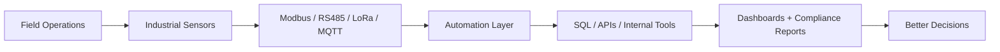

<p align="center">
  
</p>

<h1 align="center">Ali Faour</h1>

<h3 align="center">
Industrial Software Engineer · IoT Specialist · Infrastructure Project Manager
</h3>

<p align="center">
Building systems where code meets infrastructure: telemetry, automation, compliance, and field execution.
</p>

<p align="center">
  <a href="https://cyberfaour.github.io/Portfolio/">
    
  </a>
  <a href="https://www.linkedin.com/in/alifaour2022/">
    
  </a>
  <a href="mailto:ali2001faour@outlook.com">
    
  </a>
  <a href="https://github.com/Cyberfaour">
    
  </a>
</p>

---

```bash
$ whoami
Software engineer based in Abu Dhabi, building operational systems for infrastructure teams.

$ focus
.NET platforms · Python automation · Industrial IoT · SQL/data systems · compliance workflows

$ operating_principle
Make field work visible. Automate the repetitive. Turn operations into measurable systems.
```

---

## Control Room



---

## Impact Log

<table>
  <tr>
    <td align="center"><b>100+</b><br/>gas control / detection systems deployed</td>
    <td align="center"><b>300%</b><br/>field execution efficiency gain</td>
    <td align="center"><b>6h → ~2.5h</b><br/>deployment cycle reduction</td>
  </tr>
  <tr>
    <td align="center"><b>200+</b><br/>technical reports automated</td>
    <td align="center"><b>35%</b><br/>IoT transmission range improvement</td>
    <td align="center"><b>100%</b><br/>HSE / regulatory compliance focus</td>
  </tr>
</table>

---

## What I Build

<table>
<tr>
<td width="50%" valign="top">

<h3>Industrial Software Platforms</h3>

ERP-style tools, internal dashboards, asset tracking, preventive maintenance workflows, ticketing systems, and compliance records.

<b>Stack:</b><br/>
C# · ASP.NET Core MVC · SQL Server · Entity Framework · REST APIs

</td>
<td width="50%" valign="top">

<h3>IoT & Telemetry Systems</h3>

Distributed monitoring pipelines for industrial environments using embedded devices, sensors, and communication protocols.

<b>Stack:</b><br/>
Modbus · RS485 · LoRa · MQTT · ESP32 · Power BI

</td>
</tr>

<tr>
<td width="50%" valign="top">

<h3>Automation Tooling</h3>

Python and PowerShell scripts for reporting, data parsing, file processing, documentation workflows, and system administration.

<b>Stack:</b><br/>
Python · PowerShell · Excel automation · Data transformation

</td>
<td width="50%" valign="top">

<h3>Infrastructure Execution Systems</h3>

Project delivery workflows for multi-site operations, compliance tracking, stakeholder coordination, risk control, and field productivity.

<b>Focus:</b><br/>
DoE programs · ADNOC-governed systems · HSE · Lean execution

</td>
</tr>
</table>

---

## Featured Systems

> Some of my strongest work lives in professional/private environments.  
> Public repositories here focus on sanitized demos, architecture notes, reusable tooling, and case-study documentation.

---

### 01 · Gas Distribution ERP Platform

Centralized platform concept for managing LPG/NG assets, preventive maintenance schedules, service tickets, compliance records, and real-time field progress.

```txt
Problem     fragmented asset tracking and manual reporting
Solution    ERP-style internal platform for operations visibility
Built with  ASP.NET Core MVC, C#, SQL Server, EF Core
Outcome     structured workflows, faster reporting, cleaner handovers
Status      private/professional work → public-safe case study planned
```

---

### 02 · IoT Telemetry Pipeline

Telemetry architecture for distributed gas infrastructure monitoring using industrial protocols and dashboard analytics.

```txt
Problem     limited real-time visibility across distributed assets
Solution    sensor-to-dashboard telemetry pipeline
Built with  ESP32, Modbus, RS485, LoRa, MQTT, Power BI
Outcome     improved data accuracy, transmission range, and reliability
Status      sanitized prototype planned
```

---

### 03 · Compliance Automation Toolkit

Automation suite for generating technical reports, transforming field data, and standardizing project documentation.

```txt
Problem     repetitive manual documentation and report preparation
Solution    Python/PowerShell automation workflow
Built with  Python, PowerShell, Excel automation, file processing
Outcome     200+ reports generated with major time savings
Status      public-safe utilities planned
```

---

### 04 · Field Workflow Optimization Model

Execution model inspired by lean/TPS principles to reduce blocking conditions, handoffs, and context switching during multi-building deployments.

```txt
Problem     slow field cycles caused by fragmented task sequencing
Solution    flow-first execution model with specialized workstreams
Focus       lean systems, field operations, risk control, delivery speed
Outcome     reduced deployment cycle from 6 hours to around 2.5 hours
Status      case study planned
```

---

## Tech Stack

### Languages

<p>
  
  
  
  
  
  
</p>

### Backend, Data & Cloud

<p>
  
  
  
  
  
  
  
</p>

### Industrial, IoT & Systems

<p>
  
  
  
  
  
  
  
</p>

### Tools

<p>
  
  
  
  
  
  
</p>

---

## Current Build Queue

| Repository | Purpose | Status |
|---|---|---|
| `gas-distribution-erp` | ERP-style platform for LPG/NG assets, PPM, tickets, and compliance records | Preparing case study |
| `iot-telemetry-dashboard` | Modbus/LoRa/MQTT pipeline with dashboard analytics | Preparing prototype |
| `compliance-automation-toolkit` | Python/PowerShell reporting utilities | Preparing public-safe version |
| `field-workflow-optimizer` | Lean execution model for multi-site field deployment | Planned |
| `industrial-iot-notes` | Notes on telemetry, protocols, SCADA-adjacent systems, and field constraints | Planned |

---

## Experience Snapshot

```txt
Royal Development for Gas Works and Contracting
Assistant Project Manager / Software Engineer
Abu Dhabi, UAE
Dec 2023 — Present

- Coordinating gas infrastructure projects with DoE, PMC, vendors, and engineering teams
- Building automation scripts and internal tools for reporting, tracking, and documentation
- Integrating LoRa and Modbus-based IoT technologies into distributed gas systems
- Supporting compliance, risk assessments, audits, and technical handover workflows
```

```txt
Tough Leaf
Full Stack Software Engineer
Remote / Beirut, Lebanon
Aug 2022 — Jan 2023

- Built features for a US-based construction bidding platform
- Designed REST APIs and optimized SQL queries
- Worked with LAMP stack, JavaScript, jQuery, Ajax, Bootstrap, and payment integrations
- Improved platform performance, reliability, and user experience
```

---

## Credentials

| Area | Credentials |
|---|---|
| Education | B.S. Computer Engineering, Lebanese International University |
| Cloud | AWS Certified Cloud Practitioner |
| Data | IBM Data Analytics, Excel for Data Analysis, Python for Data Science |
| Networking & Security | Cisco Network Support and Security, Endpoint Security, Introduction to IoT |
| Systems | Electric Power Systems, PLC/SCADA exposure, embedded systems, signal processing |

---

## Engineering Notes

```txt
Good software is not just clean code.

It should reduce friction.
It should make operations visible.
It should remove repeated manual work.
It should help people make better decisions faster.
```

I care about systems that survive real-world constraints: unclear inputs, field pressure, compliance requirements, hardware limitations, stakeholder changes, and deadlines that do not wait for perfect conditions.

---

## GitHub Signal

<p align="center">
  
  
</p>

---

## Connect

<p align="center">
  <a href="https://cyberfaour.github.io/Portfolio/">Portfolio</a>
  ·
  <a href="https://www.linkedin.com/in/alifaour2022/">LinkedIn</a>
  ·
  <a href="mailto:ali2001faour@outlook.com">Email</a>
</p>

<p align="center">
  <b>Building industrial software systems where code meets infrastructure.</b>
</p>
